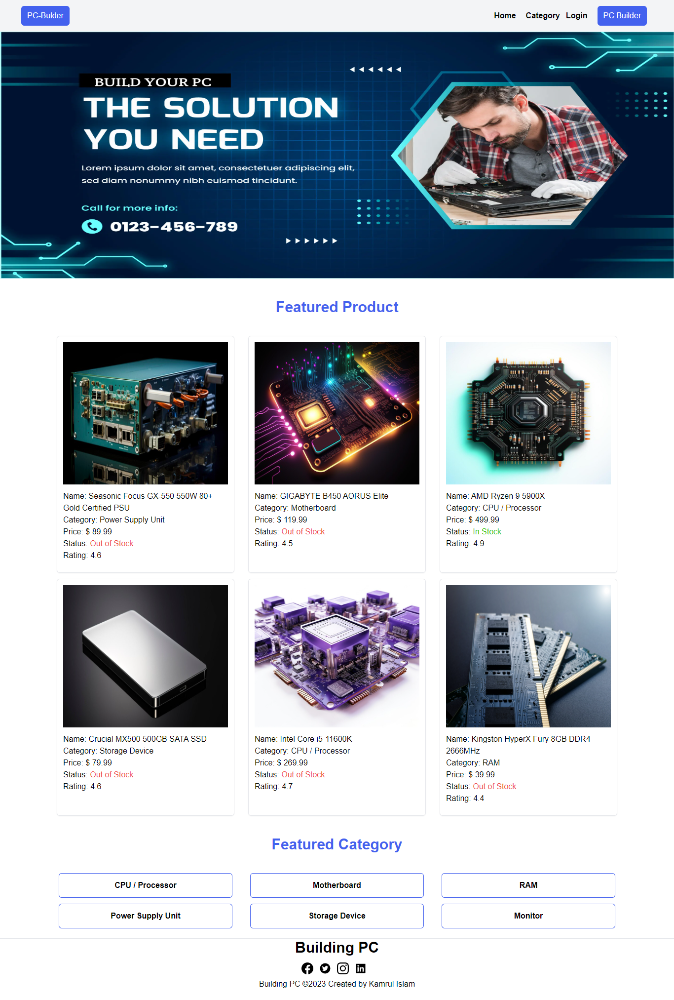

### PC-Build Platform

### Live Link:

```
https://pc-builder-nextjs-lac.vercel.app/
```



### Introduction

Welcome to the PC Builder Frontend! This web application serves as the user
interface for the PC Building platform, where users can browse and discover
various PC instruments different categories.

The primary objective of this frontend application is to provide users with a
seamless and enjoyable experience while exploring the extensive collection of
PC building instruments available in the PC Build website.
